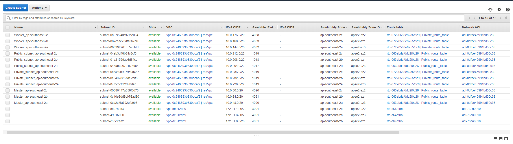

# web-kubernetes

[](https://github.com/junchil/web-kubernetes/releases)
[](https://travis-ci.org/junchil/web-kubernetes) 

Host web application inside AWS EKS cluster using ALB + NGINX. The web link: https://web.stevejcliu.com/

This repo builds a CICD pipeline for depolying this web application into EKS cluster. There is no manual task needed during this CICD process. The related travis build can be found through the build status.

Table of Contents                                                                                                                       
============================================
* [Directory Structure](DIRECTORY.md)
* [Set up](SETUP.md)
* [CICD](CICD.md)
* [EKS Cluster](#eks-cluster)
* [Helm Charts](#helm-charts)
* [Reference](#reference)
* [To Do](TODO.md)

## EKS Cluster


VPC:

* In the vpc module, it create four subnets: public subnets, private subnets, master subnets and worker subnets.
* Public subnets and master subnets are public to internet. They are connected to [Internet gateway](https://docs.aws.amazon.com/vpc/latest/userguide/VPC_Internet_Gateway.html).
* Private subnets and worker subnets are private. They are connected to [NAT gateway](https://docs.aws.amazon.com/vpc/latest/userguide/vpc-nat-gateway.html) for getting internet traffic.
* Bastion host sits in the public subnets.
* Amazon [EKS](https://aws.amazon.com/eks/) is using both master subnets and worker subnets.
* Kubernetes worker nodes sit in worker subnets.



Cluster:

* Kubernetes worker nodes are using [Auto Scaling Group](https://docs.aws.amazon.com/autoscaling/ec2/userguide/AutoScalingGroup.html). It also supports [Spot Instance](https://docs.aws.amazon.com/AWSEC2/latest/UserGuide/using-spot-instances.html).

Bastion host:

* [Bastion host](https://docs.aws.amazon.com/quickstart/latest/linux-bastion/architecture.html) is a single vm which sits in the public subnets. It is used for managing the kubernetes work nodes if there is a need.
* SSH port 22 is enabled in bastion host vm.


## Helm charts

- Kubernetes ingress resources by provisioning Application Load Balancers with [aws-alb-ingress-controller](https://github.com/helm/charts/tree/master/incubator/aws-alb-ingress-controller)
- Auto DNS entry with [external-dns](https://github.com/helm/charts/tree/master/stable/external-dns)
- Ingress controller that uses ConfigMap to store the nginx configuration. [nginx-ingress](https://github.com/helm/charts/tree/master/stable/nginx-ingress)
- SSL Enable
- Hostname -> routing rules
- Can support multiple ingress class


```
kubectl get po
NAME                                                  READY   STATUS    RESTARTS   AGE
reawebrelease-albcontroller-64bc5d66b9-6sjs8          1/1     Running   0          13h
reawebrelease-externaldns-6bd6fb5cf7-zwcwl            1/1     Running   0          13h
reawebrelease-nginx-controller-7f557dfcf9-b2xxh       1/1     Running   0          157m
reawebrelease-nginx-default-backend-7569d789f-vsjcm   1/1     Running   0          13h
reawebrelease-reaweb-5dd9d87b77-hsvp5                 1/1     Running   0          157m
reawebrelease-reaweb-5dd9d87b77-xgg24                 1/1     Running   0          13h
reawebrelease-testbox-67d8cd9c6-nmn87                 1/1     Running   0          13h
```

```
kubectl get deploy
NAME                                  READY   UP-TO-DATE   AVAILABLE   AGE
reawebrelease-albcontroller           1/1     1            1           14h
reawebrelease-externaldns             1/1     1            1           14h
reawebrelease-nginx-controller        1/1     1            1           14h
reawebrelease-nginx-default-backend   1/1     1            1           14h
reawebrelease-reaweb                  2/2     2            2           14h
reawebrelease-testbox                 1/1     1            1           14h
```

```
kubectl get svc
NAME                                  TYPE        CLUSTER-IP       EXTERNAL-IP   PORT(S)                      AGE
kubernetes                            ClusterIP   172.20.0.1       <none>        443/TCP                      40h
reawebrelease-externaldns             ClusterIP   172.20.161.112   <none>        7979/TCP                     13h
reawebrelease-nginx-controller        NodePort    172.20.208.243   <none>        80:30959/TCP,443:30307/TCP   13h
reawebrelease-nginx-default-backend   ClusterIP   172.20.32.31     <none>        80/TCP                       13h
reawebrelease-reaweb                  NodePort    172.20.54.40     <none>        9292:31678/TCP               13h
```

```
kubectl get ingress
NAME                        HOSTS   ADDRESS                                                                       PORTS   AGE
reawebrelease-elb-ingress   *       ac97d66b-default-reawebrel-8f71-1282660860.ap-southeast-2.elb.amazonaws.com   80      14h
reawebrelease-reaweb        *       10.0.148.82
```

```
kubectl get nodes
NAME                                              STATUS   ROLES    AGE   VERSION
ip-10-0-148-82.ap-southeast-2.compute.internal    Ready    <none>   42h   v1.16.8-eks-e16311
ip-10-0-162-59.ap-southeast-2.compute.internal    Ready    <none>   16h   v1.16.8-eks-e16311
ip-10-0-188-140.ap-southeast-2.compute.internal   Ready    <none>   42h   v1.16.8-eks-e16311
```

## Reference

1. https://aws.amazon.com/blogs/opensource/kubernetes-ingress-aws-alb-ingress-controller/

2. https://docs.aws.amazon.com/eks/latest/userguide/alb-ingress.html

3. https://github.com/helm/charts/tree/master/incubator/aws-alb-ingress-controller

4. https://github.com/kubernetes-sigs/external-dns/blob/master/docs/tutorials/public-private-route53.md

5. https://github.com/kubernetes-sigs/external-dns/blob/master/docs/tutorials/alb-ingress.md

6. https://medium.com/@sajid2045/aws-eks-ingress-option-alb-nginx-fc64a4a5ea9f