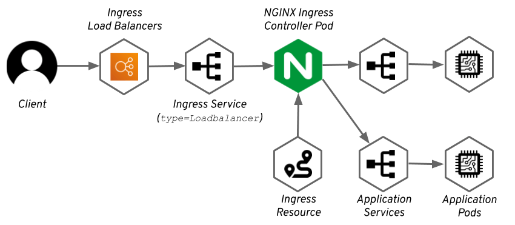

# web-kubernetes

 

Host web application inside AWS EKS cluster using ALB + NGINX. The web link: https://web.stevejcliu.com/

This repo builds a CICD pipeline for depolying a web application into EKS cluster. There is no manual task needed during this CICD process. The related travis build can be found through the build status.

Table of Contents                                                                                                                       
============================================
* [Directory Structure](DIRECTORY.md)
* [Set up](SETUP.md)
* [CICD](CICD.md)
* [EKS Cluster](#eks-cluster)
* [Web Diagram](#web-diagram)
* [Reference](#reference)
* [To Do](#to-do)

## EKS Cluster

## Web Diagram

- Auto DNS entry with `externalDns`
- SSL termination at ALB
- Wildcard ingress 
- Hostname -> routing rules
- Can support multiple ingress class

## Reference

1. https://aws.amazon.com/blogs/opensource/kubernetes-ingress-aws-alb-ingress-controller/

2. https://docs.aws.amazon.com/eks/latest/userguide/alb-ingress.html

3. https://github.com/helm/charts/tree/master/incubator/aws-alb-ingress-controller

4. https://github.com/kubernetes-sigs/external-dns/blob/master/docs/tutorials/public-private-route53.md

5. https://github.com/kubernetes-sigs/external-dns/blob/master/docs/tutorials/alb-ingress.md

6. https://medium.com/@sajid2045/aws-eks-ingress-option-alb-nginx-fc64a4a5ea9f

## To Do